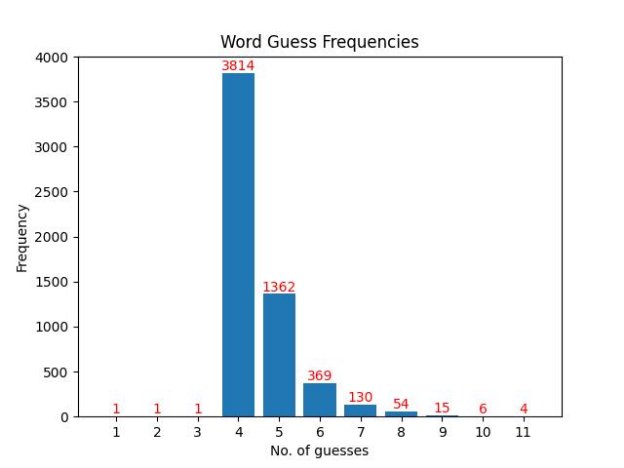
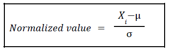

# Wordle-Finder 
[My project YouTube Link](https://youtu.be/bsNv2LcR04c)

##### Wordle Game (Here you can play!)   
https://www.nytimes.com/games/wordle  
https://wordlegame.org/

# What is Wordle?  
 
Wordle is a daily online word game created by Josh Wardle and later sold to The New York Times Company. Every 24 hours, there is a new word of the day, and we have to figure it out in 6 tries. Since its launch, the game has become very popular. According to The New Times, over 300,000 people play the game daily.  

 

# Problem statement: 
Find a strategy to guess the right word in Wordle in the least number of guesses.

### Methodology:

1. Downloading a database of 5-letter words.
2. Analyse these words
3. Propose a strategy based on the analysis
4. Testing our strategy.
5. Write a program to guess the correct word using our strategy.
6. Apply the program for every word in the database and take the average number of guesses.
7. Develop a program to apply an algorithm on the Wordle website to guess the word.

# Analysis

Used Python to analyse a 5760 word database of 5-letter words. This data is used to plot graphs, which helped further analyze the data. 

  

Here, the frequency of each letter occurring in all words.

# Strategy

Based on the analysis done on our database, I developed strategies to guess the right word in the least number of guesses and within 6 guesses. First, pass fixed words as initial guesses and then the code will find the correct position, wrong positions and letters not present in the word. Based on those details, the code will decide the next guess.

- ***Method -1:*** 
 
Let's choose the first 5 most occurring letters: [ S, E, A, O, R]
Make one word from it: {AROSE}
So, the first initial guess will be the word ‘AROSE’ each time, and then the code will provide further guesses.

**Result:** 
After applying this algorithm for all words, the output is as follows.
 
  
But we can see here that 705 words are guessed at an attempt larger than 6.

- ***Method -2:***
 
Let's choose the first 10 most occurring letters: [ S, E, A, O, R, I, L, T, N, D]
Make two words from it: {STAND, OILER}
So, the first initial guess will be the word ‘STAND’, and the second guess will be the word ‘OILER’ each time, and then the code will provide further guesses.

**Result:** 
After applying this algorithm for all words, the output is as follows.
 
 
But we can see that 380 words are guessed at an attempt larger than 6.

- ***Method -3:***
 
Let's choose the first 15 most occurring letters: [ S, E, A, O, R, I, L, T, N, D, U, C, P, Y, M] 
Make three words from it: {CANDY, PLUME, RIOTS}
So, the first initial guess will be the word ‘CANDY’, the second guess will be the word ‘PLUME’, and the third guess will be the word ‘RIOTS’ each time, and then the code will provide further guesses.

**Result:** 
After applying this algorithm for all words, the output is as follows.
 
 
But we can see that 209 words are guessed at an attempt larger than 6.

- ***Method -4:***
 
Let's choose the first 20 most occurring letters:[ S, E, A, O, R, I, L, T, N, D, U, C, P, Y, M, H, B, G, K, F]
Make four words from it: {SHELF, DIRTY, BACON, GRUMP}
So, the first initial guess will be the word ‘SHELF’, the second guess will be the word ‘DIRTY’, the third guess will be the word ‘BACON’, and the fourth guess will be the word ‘GRUMP’ each time, and then the code will provide further guesses.

**Result:** 
After applying this algorithm for all words, the output is as follows.
 
 
But we can see that 113 words are guessed at an attempt larger than 6.

- ***Method -5:***
 
Let's choose the first 25 most occurring letters:[ S, E, A, O, R, I, L, T, N, D, U, C, P, Y, M, H, B, G, K, F, W, V, X, Z, J]
Make four words from it: {FJORD, GUCKS, NYMPH, VIBEX, WALTZ}
So, the first initial guess will be the word ‘FJORD’, the second guess will be the word ‘GUCKS’, the third guess will be the word ‘NYMPH’, the fourth guess will be the word ‘VIBEX’, and the fifth guess will be the word ‘WALTZ’ each time, and then the code will provide further guesses.

**Result:** 
After applying this algorithm for all words, the output is as follows.
 
 
But we can see that 220 words are guessed at an attempt larger than 6.

# Conclusion:

X = no. of guesses greater than 6 
 
Here, first normalized both the data columns using max-min normalisation. Then, for the final combined score, selected weightage of 60% for the value of X and 40% for the value of a mean as we want to minimise guess number and mean also, but priority is given to X value. 
   

where µ = mean and σ = standard deviation

 

So according to calculation Method-3 has less value for a combined score, hence it is the most optimised solution.

# Python Program working

-**Step - 1:**  
The first code will give an initial guess of ‘ CANDY.’  

 

-**Step - 2:**  
Then we will enter the word ‘ CANDY ’ on the webpage of the WORDLE game. 

 

-**Step - 3:**   
The respective colours we will fill in the Python GUI window. 

 

-**Step - 4:** 
After clicking on the ‘Submit’ button, the code will give us the next guess and this process continues until a word is guessed. 

 

 

 

 

 

 

 

 

 

# Thank You ! 
